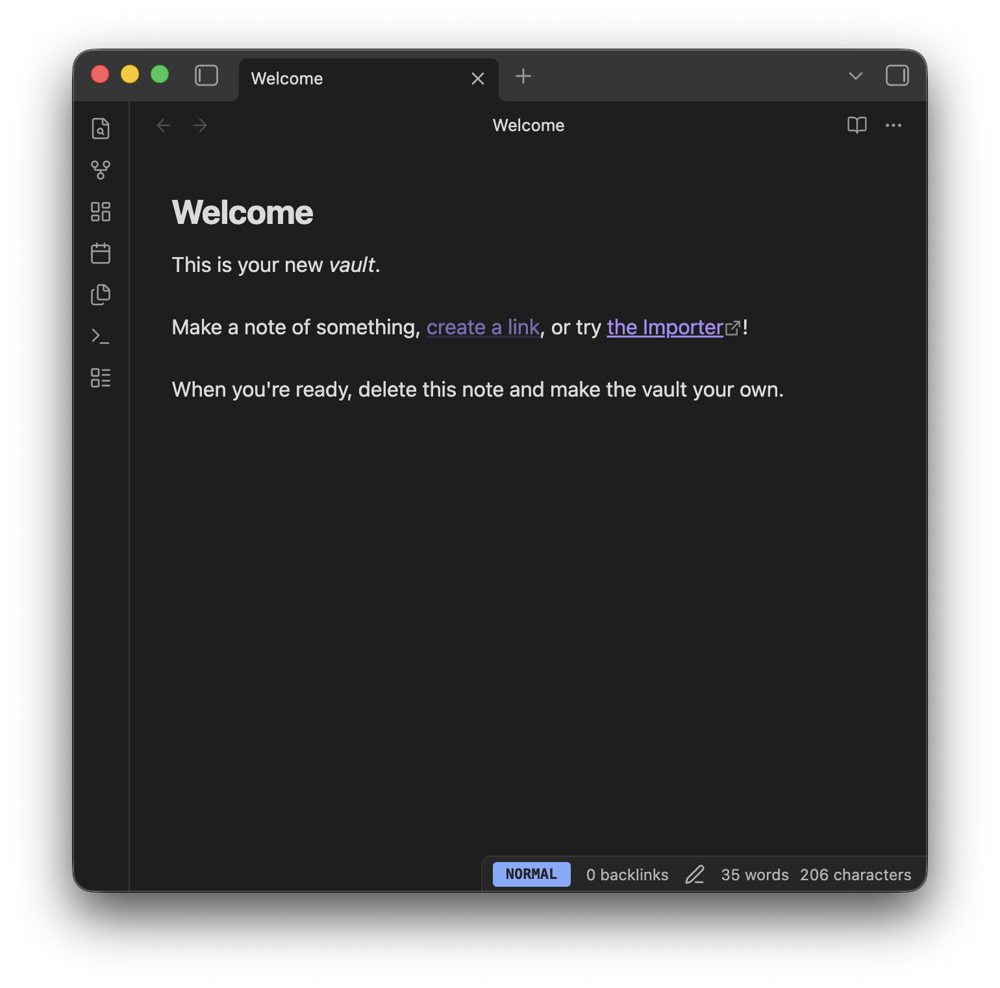

# Vim Mode Status for Obsidian

A simple, lightweight Obsidian plugin that displays the current Vim mode in your status bar with customizable colors.

 _(Example visualization)_

## Features

- **Real-time Status**: Shows the current Vim mode (Normal, Insert, Visual, Replace, Command) in the status bar.
- **Color Coded**: Easily distinguish modes at a glance with customizable background colors for each mode.
- **Display Formats**: Choose between full text (e.g., `NORMAL`) or abbreviated (e.g., `N`) display to save status bar space.

## Settings

You can customize the following options in **Settings > Vim Mode Status**:

| Setting                | Description                                            | Default            |
| :--------------------- | :----------------------------------------------------- | :----------------- |
| **Display Format**     | Choose between **Full** (`NORMAL`) or **Short** (`N`). | Full               |
| **Normal Mode Color**  | Background color for Normal mode.                      | `#82aaff` (Blue)   |
| **Insert Mode Color**  | Background color for Insert mode.                      | `#c3e88d` (Green)  |
| **Visual Mode Color**  | Background color for Visual mode.                      | `#ffcb6b` (Yellow) |
| **Replace Mode Color** | Background color for Replace mode.                     | `#993142` (Red)    |
| **Command Mode Color** | Background color for Command mode.                     | `#89ddff` (Cyan)   |

## Installation

### From Community Plugins

_(Once the plugin is approved)_

1. Open **Settings** > **Community plugins**.
2. Turn off **Safe mode**.
3. Click **Browse** and search for **Vim Mode Status**.
4. Click **Install** and then **Enable**.

### Manual Installation

1. Go to the [Releases](https://github.com/penyt/vim-mode-status/releases) page.
2. Download `main.js`, `manifest.json`, and `styles.css` from the latest release.
3. Create a folder named `vim-mode-status` in your vault's plugin folder: `<Vault>/.obsidian/plugins/vim-mode-status`.
4. Move the downloaded files into that folder.
5. Reload Obsidian and enable the plugin in **Settings** > **Community plugins**.

## License

[MIT](LICENSE)

## Donate

